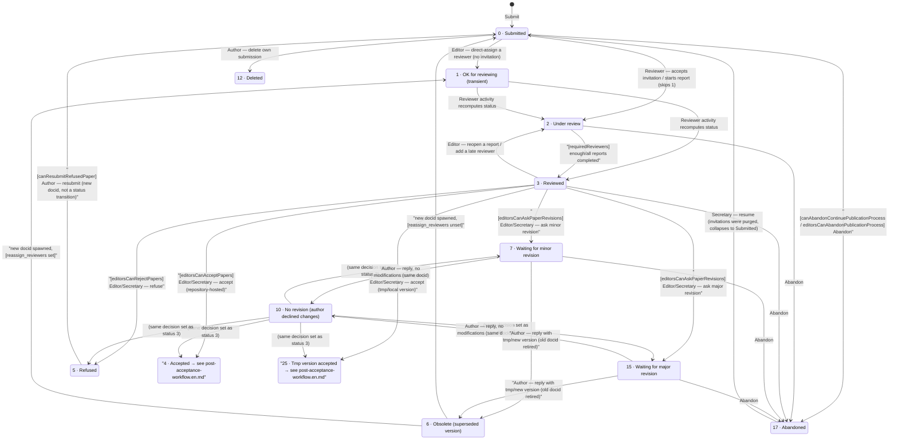

# Editorial workflow (complete, current / classic pipeline — `staging`)

*[English](editorial-workflow.en.md) · [Français](editorial-workflow.fr.md)*

This document maps the **complete** paper status state machine on `staging`, from initial submission (status 0) through peer review, editorial decision, the revision loop, and acceptance, up to publication (status 16). It documents the *current, non-opt-in* pipeline only — the alternative pipeline introduced by PR #1083 is deliberately out of scope for now (see `tmp/pr1083.md` for that comparison once this baseline is settled).

For the detailed post-acceptance sub-graph (statuses 4/25 → 16, copy-editing), see **`docs/post-acceptance-workflow.en.md`** — this document stops at the acceptance fork and links out to it, rather than duplicating it. For the full status enumeration/labels, see `docs/paper-statuses.md`.

All claims below are sourced from `origin/staging` with file:line citations, not inferred from constant names — several constants turned out to be dead code (see "Unreachable statuses" below).

## Diagram

`[setting]` = only available/relevant when that journal setting is enabled — see the settings table below. Unmarked edges are unconditional (subject only to role/ACL). Dashed intent in prose below is rendered as plain arrows above for Mermaid simplicity; see notes for nuance.

## Unreachable / legacy statuses

Five status constants exist in `Paper.php` but are **never written by any code path** on `staging` (verified by grepping every `setStatus()`/`updateStatus()` call site) — they are legacy leftovers, not part of the live workflow:

| Status | Constant | Why it's dead |
|---|---|---|
| 8 | `STATUS_WAITING_FOR_COMMENTS` | No caller sets it; only referenced in status dictionaries |
| 9 | `STATUS_TMP_VERSION` | Superseded by the comment-type flag `Episciences_CommentsManager::TYPE_REVISION_ANSWER_TMP_VERSION` — the paper's own status never becomes 9 |
| 11 | `STATUS_NEW_VERSION` | Same story, superseded by `TYPE_REVISION_ANSWER_NEW_VERSION` |
| 13 | `STATUS_REMOVED` | Only read via `isRemoved()` (`Paper.php:2734`), never set |
| 14 | `STATUS_REVIEWERS_INVITED` | "Invited" is tracked on `Episciences_User_Assignment`/`Episciences_User_Invitation` (their own `STATUS_PENDING`), not on the paper |

## Transition table

| From → To | Gate | Actor | Action / method | Label |
|---|---|---|---|---|
| — → 0 | — | Author | `Episciences_Submit::buildValuesToPopulatePaper()` | Initial submission |
| 0 → 12 | Owner only, status must be exactly 0 | Author | `PaperController::removeAction()` (`:3510-3569`, status L3541) | Delete own just-submitted paper |
| 0 → 1 | — | Editor/Secretary | `PaperController::applyRating()` direct-assign path (`:3213-3216`) | Editor assigns a reviewer directly, bypassing invitation |
| 0/1 → 2 | — | Reviewer (self-accept) or Editor (accept on behalf) | `performReviewerInvitationAcceptance()` → `ratingRefreshPaperStatus()` (`PaperDefaultController.php:1162-1229`) | Reviewer accepts invitation (jumps straight past status 1) |
| 1/2/3 → 2 or 3 (recomputed) | **`requiredReviewers`** via `isReviewed()` (`Paper.php:3064-3091,3078-3090`) | Reviewer | `PaperController::save_rating()` → `completedRatingSendNotification()` → `ratingRefreshPaperStatus()` (`:3276-3332`) | Reviewer saves/submits a report |
| 3 → 2 | — | Editor/Secretary | `AdministratepaperController::refreshratingAction()` (`:3338-3377`) | Revert a report to work-in-progress, reopen review |
| 3 → 2 | — | Editor/Secretary | `applyRating()`, late-assignment branch (`:3218-3221`) | Editor adds a reviewer after paper was already "Reviewed" |
| 3 (or 10) → 4 | **[editorsCanAcceptPapers]** for editors; Secretary bypasses | Editor/Secretary | `AdministratepaperController::acceptAction()`, non-tmp branch (`:1871-2002`, fork `:1904-1909`) | Accept (repository-hosted paper) |
| 3 (or 10) → 25 | same gate, `isTmp()` (`getRepoid()===0`) | Editor/Secretary | same `acceptAction()`, tmp branch (`:1908-1947`) | Accept (locally-hosted "tmp version") |
| 3 (or 10) → 5 | **[editorsCanRejectPapers]** for editors; Secretary bypasses | Editor/Secretary | `AdministratepaperController::refuseAction()` (`:2149-2206`, status L2180) | Refuse |
| 3 (or 10) → 7 | **[editorsCanAskPaperRevisions]** for editors; Secretary bypasses; optional **[toRequireRevisionDeadline]** forces a deadline field | Editor/Secretary | `AdministratepaperController::revisionAction()`, minor branch (`:4669-4825`, fork `:4808-4817`) | Ask minor revision |
| 3 (or 10) → 15 | same, major branch | Editor/Secretary | same `revisionAction()` | Ask major revision |
| 3 → *(no change)* | inverse of the three settings above | Editor without decision rights | `AdministratepaperController::suggeststatusAction()` (`:2218-2271`) | "Recommander d'accepter / refuser / …" — comment only, no status change |
| 7/15 → 10 | — | Author | `PaperController::saveanswerAction()`, no-modification branch (`:1240-1357`, fork `:1311-1336`) | Reply "no modifications" (same docid) |
| 7/15 → 6 (old docid) + new clone → 0 or 1 | new docid lands on 1 if the original revision request had **`reassign_reviewers`** checked, else 0 | Author | `PaperController::savetmpversionAction()` (old→obsolete `:1512`; new-status fork `:1525-1531`) | Reply with a "tmp version" patch file |
| 7/15 → 6 (old docid) + new clone → 0 or 1 | same | Author | `PaperController::savenewversionAction()` → `determineNewPaperStatus()` (`:1830-1925`, `:2118-2189`; old→obsolete via `updatePreviousVersionStatus()` `:2431-2444`) | Reply with a full new deposited version |
| 7/15 → *(no change)* | — | Author | `saveanswerAction()`, contact/clarification branch (`:1263-1337`) | Ask a clarifying question, no status change |
| 5 → 0 *(new docid, not an in-place transition)* | **[canResubmitRefusedPaper]** | Author | `Paper::manageNewVersionErrors()` surfaces the link (`:3739-3950`, refused branch `:3937-3949`); actual resubmission via `SubmitController.php:106-119` | Resubmit a refused paper as a new submission tied to the same `concept_identifier` |
| most editable statuses → 17 | Secretary always; Owner if **[canAbandonContinuePublicationProcess]**; assigned Editor if **[editorsCanAbandonPublicationProcess]** | Owner/Editor/Secretary | `PaperController::applyAbandon()` via `abandonpublicationprocessAction()` (`:3878-3985`, status L3983); gate `isAllowedToAbandonPublicationProcess()` (`:1966-1987`) | Abandon publication process |
| 17 → *(last recorded status, collapsing 1/2→0)* | Secretary only | Secretary | `PaperController::continuepublicationprocessAction()` (`:3690-3775`, restore gate L3712) | Resume an abandoned paper (pending invitations were purged, so 1/2 collapse back to 0) |

## Settings inventory (pre-acceptance phase)

| Setting constant | String key | Gates |
|---|---|---|
| `SETTING_REQUIRED_REVIEWERS` | `requiredReviewers` | Threshold for the 2→3 auto-transition (`isReviewed()`); also gates whether ordinary editors (not Secretary) can see Accept/Refuse/Revision buttons at all before enough reports are in |
| `SETTING_EDITORS_CAN_ACCEPT_PAPERS` | `editorsCanAcceptPapers` | Enables `acceptAction()` for ordinary editors (Secretary always bypasses) |
| `SETTING_EDITORS_CAN_REJECT_PAPERS` | `editorsCanRejectPapers` | Enables `refuseAction()` for ordinary editors |
| `SETTING_EDITORS_CAN_ASK_PAPER_REVISIONS` | `editorsCanAskPaperRevisions` | Enables `revisionAction()` (minor/major) for ordinary editors |
| `SETTING_TO_REQUIRE_REVISION_DEADLINE` | `toRequireRevisionDeadline` | Forces a deadline field on minor/major revision requests |
| `SETTING_SYSTEM_PAPER_FINAL_DECISION_ALLOW_REVISION` | `paperFinalDecisionAllowRevision` | Also affects the post-acceptance fork of `revisionAction()`/`determineNewPaperStatus()` for already-accepted papers — see `docs/post-acceptance-workflow.en.md` |
| `SETTING_CAN_RESUBMIT_REFUSED_PAPER` | `canResubmitRefusedPaper` | Shows the "resubmit" path for refused papers (new docid, not an in-place transition) |
| `SETTING_CAN_ABANDON_CONTINUE_PUBLICATION_PROCESS` | `canAbandonContinuePublicationProcess` | Lets the paper's own owner abandon |
| `SETTING_EDITORS_CAN_ABANDON_CONTINUE_PUBLICATION_PROCESS` | `editorsCanAbandonPublicationProcess` | Lets an assigned editor abandon |
| `SETTING_ENCAPSULATE_REVIEWERS` | `encapsulateReviewers` | Not a status gate — restricts the reviewer-invitation pool to the volume/special issue |
| `SETTING_REVIEWERS_CAN_COMMENT_ARTICLES` | `reviewersCanCommentArticles` | Not a status gate — toggles the reviewer↔author comment box |
| *(per-request option, not a journal setting)* `reassign_reviewers` | — | Checkbox on an individual revision request; decides whether a resubmitted paper lands at Submitted(0) or OK for reviewing(1) |

## Notes

1. **Status 1 (`OK_FOR_REVIEWING`) is transient in practice.** `ratingRefreshPaperStatus()` only ever outputs 2 or 3, never 1 — status 1 is only durably observed right after an editor direct-assigns a reviewer, or right after a reviewer-reassigned resubmission, and disappears as soon as that reviewer's invitation/report activity fires again.
2. **`acceptAction()`/`refuseAction()`/`revisionAction()` have no server-side "must be status 3" check.** The apparent "decide only from Reviewed" rule is a UI convention (`paper_status_button.phtml` button visibility), not enforced by the controllers — hence status 10 (`NO_REVISION`) reaches the same decision set as status 3 through the same generic UI branch (`isRevisionRequested()` is false for status 10, so it falls through to the standard accept/refuse/revision buttons).
3. **"tmp version" vs "new version" author replies are functionally identical for re-review purposes** — both spawn a brand-new docid that restarts the 0/1→2→3 cycle from scratch and retire the old docid to Obsolete(6). The only differences are upload semantics (small patch vs. full re-deposit) and some bookkeeping (editor reassignment, XML copy) in `savetmpversionAction()`.
4. **The 25/29/30/31 "tmp-accepted" family is not a separate state machine.** It's the exact same `acceptAction()`/`revisionAction()`/answer-form code as the pre-acceptance decision point, forked purely on `isTmp()` (`getRepoid()===0`) and the `paperFinalDecisionAllowRevision` setting. See `docs/post-acceptance-workflow.en.md` for what happens next.
5. **Removing a reviewer never recomputes paper status.** `savereviewerremovalAction()` deletes the assignment/report but doesn't call `ratingRefreshPaperStatus()` — a paper stuck at Reviewed(3) whose only reviewer is removed stays at 3 until an editor manually acts.
6. **Abandon (17) is reachable from essentially any editable status** (no explicit status whitelist in the controller, only a permission gate) and is reversible by a Secretary, who restores the last recorded status — except pending invitations are purged on abandon, so a restore from 1/2 collapses back down to Submitted(0).

## Relation to the post-acceptance phase

Status 4 (Accepted) and 25 (Tmp version accepted) are the boundary of this document. From there, the paper enters the copy-editing / final-publication workflow fully mapped in **`docs/post-acceptance-workflow.en.md`**, including the `paperFinalDecisionAllowRevision`-gated 26/27/28/32/33 sub-flow that this document's settings table already cross-references.
