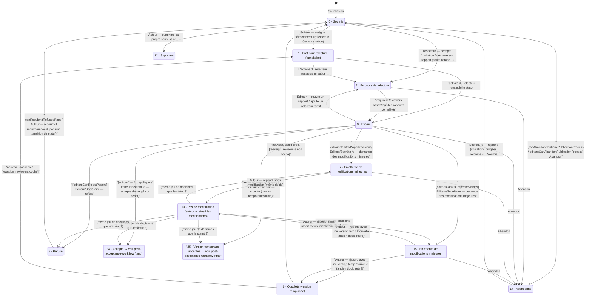

# Workflow éditorial (complet, circuit actuel / classique — `staging`)

*[🇬🇧 English](editorial-workflow.en.md) · [🇫🇷 Français](editorial-workflow.fr.md)*

Ce document cartographie la machine à états **complète** des statuts d'article sur `staging`, depuis la soumission initiale (statut 0) jusqu'à la relecture par les pairs, la décision éditoriale, la boucle de révision et l'acceptation, jusqu'à la publication (statut 16). Il documente uniquement le circuit *actuel, non opt-in* — le pipeline alternatif introduit par la PR #1083 est volontairement laissé de côté pour l'instant (voir `tmp/pr1083.md` pour cette comparaison une fois cette base stabilisée).

Pour le sous-graphe détaillé de la phase post-acceptation (statuts 4/25 → 16, préparation de copie), voir **`docs/post-acceptance-workflow.fr.md`** — ce document s'arrête au fork d'acceptation et y renvoie plutôt que de le dupliquer. Pour l'énumération complète des statuts/libellés, voir `docs/paper-statuses.md`.

Toutes les affirmations ci-dessous sont vérifiées directement dans `origin/staging`, avec citations fichier:ligne — pas déduites des noms de constantes. Plusieurs constantes se sont d'ailleurs révélées être du code mort (voir « Statuts inatteignables » ci-dessous).

## Schéma

`[réglage]` = disponible/pertinent uniquement quand ce réglage de revue est activé — voir le tableau des réglages ci-dessous. Les arêtes non annotées sont inconditionnelles (soumises uniquement au rôle/ACL). Les nuances non représentables proprement en Mermaid sont précisées dans les notes.

## Statuts inatteignables / historiques

Cinq constantes de statut existent dans `Paper.php` mais ne sont **jamais écrites par aucun chemin de code** sur `staging` (vérifié en recherchant chaque appel `setStatus()`/`updateStatus()`) — ce sont des résidus historiques, pas des éléments vivants du workflow :

| Statut | Constante | Pourquoi c'est mort |
|---|---|---|
| 8 | `STATUS_WAITING_FOR_COMMENTS` | Aucun appelant ne le positionne ; référencé seulement dans les dictionnaires de statuts |
| 9 | `STATUS_TMP_VERSION` | Remplacé par le type de commentaire `Episciences_CommentsManager::TYPE_REVISION_ANSWER_TMP_VERSION` — le statut de l'article lui-même ne devient jamais 9 |
| 11 | `STATUS_NEW_VERSION` | Même histoire, remplacé par `TYPE_REVISION_ANSWER_NEW_VERSION` |
| 13 | `STATUS_REMOVED` | Seulement lu via `isRemoved()` (`Paper.php:2734`), jamais positionné |
| 14 | `STATUS_REVIEWERS_INVITED` | « Invité » est suivi sur `Episciences_User_Assignment`/`Episciences_User_Invitation` (leur propre `STATUS_PENDING`), pas sur l'article |

## Tableau des transitions

| De → Vers | Condition | Acteur | Action / méthode | Libellé |
|---|---|---|---|---|
| — → 0 | — | Auteur | `Episciences_Submit::buildValuesToPopulatePaper()` | Soumission initiale |
| 0 → 12 | Propriétaire uniquement, statut exactement 0 | Auteur | `PaperController::removeAction()` (`:3510-3569`, statut L3541) | Supprimer sa propre soumission fraîche |
| 0 → 1 | — | Éditeur/Secrétaire | `PaperController::applyRating()`, chemin d'assignation directe (`:3213-3216`) | L'éditeur assigne directement un relecteur, sans invitation |
| 0/1 → 2 | — | Relecteur (auto-acceptation) ou Éditeur (accepte au nom du relecteur) | `performReviewerInvitationAcceptance()` → `ratingRefreshPaperStatus()` (`PaperDefaultController.php:1162-1229`) | Le relecteur accepte l'invitation (saute directement le statut 1) |
| 1/2/3 → 2 ou 3 (recalculé) | **`requiredReviewers`** via `isReviewed()` (`Paper.php:3064-3091,3078-3090`) | Relecteur | `PaperController::save_rating()` → `completedRatingSendNotification()` → `ratingRefreshPaperStatus()` (`:3276-3332`) | Le relecteur enregistre/soumet un rapport |
| 3 → 2 | — | Éditeur/Secrétaire | `AdministratepaperController::refreshratingAction()` (`:3338-3377`) | Repasser un rapport en cours, rouvrir la relecture |
| 3 → 2 | — | Éditeur/Secrétaire | `applyRating()`, branche d'assignation tardive (`:3218-3221`) | L'éditeur ajoute un relecteur alors que l'article était déjà « Évalué » |
| 3 (ou 10) → 4 | **[editorsCanAcceptPapers]** pour les éditeurs ; le Secrétaire contourne | Éditeur/Secrétaire | `AdministratepaperController::acceptAction()`, branche non-temporaire (`:1871-2002`, fork `:1904-1909`) | Accepter (article hébergé sur un dépôt) |
| 3 (ou 10) → 25 | même condition, `isTmp()` (`getRepoid()===0`) | Éditeur/Secrétaire | même `acceptAction()`, branche temporaire (`:1908-1947`) | Accepter (« version temporaire » hébergée localement) |
| 3 (ou 10) → 5 | **[editorsCanRejectPapers]** pour les éditeurs ; le Secrétaire contourne | Éditeur/Secrétaire | `AdministratepaperController::refuseAction()` (`:2149-2206`, statut L2180) | Refuser |
| 3 (ou 10) → 7 | **[editorsCanAskPaperRevisions]** pour les éditeurs ; le Secrétaire contourne ; **[toRequireRevisionDeadline]** optionnel impose un champ échéance | Éditeur/Secrétaire | `AdministratepaperController::revisionAction()`, branche mineure (`:4669-4825`, fork `:4808-4817`) | Demander des modifications mineures |
| 3 (ou 10) → 15 | idem, branche majeure | Éditeur/Secrétaire | même `revisionAction()` | Demander des modifications majeures |
| 3 → *(aucun changement)* | inverse des trois réglages ci-dessus | Éditeur sans droit de décision | `AdministratepaperController::suggeststatusAction()` (`:2218-2271`) | « Recommander d'accepter / refuser / … » — commentaire seul, pas de changement de statut |
| 7/15 → 10 | — | Auteur | `PaperController::saveanswerAction()`, branche sans modification (`:1240-1357`, fork `:1311-1336`) | Répondre « sans modification » (même docid) |
| 7/15 → 6 (ancien docid) + nouveau clone → 0 ou 1 | le nouveau docid arrive au statut 1 si la demande de révision d'origine avait **`reassign_reviewers`** coché, sinon 0 | Auteur | `PaperController::savetmpversionAction()` (ancien→obsolète `:1512` ; fork du nouveau statut `:1525-1531`) | Répondre avec un fichier de « version temporaire » |
| 7/15 → 6 (ancien docid) + nouveau clone → 0 ou 1 | idem | Auteur | `PaperController::savenewversionAction()` → `determineNewPaperStatus()` (`:1830-1925`, `:2118-2189` ; ancien→obsolète via `updatePreviousVersionStatus()` `:2431-2444`) | Répondre avec une nouvelle version complète déposée |
| 7/15 → *(aucun changement)* | — | Auteur | `saveanswerAction()`, branche question/clarification (`:1263-1337`) | Poser une question de clarification, pas de changement de statut |
| 5 → 0 *(nouveau docid, pas une transition en place)* | **[canResubmitRefusedPaper]** | Auteur | `Paper::manageNewVersionErrors()` affiche le lien (`:3739-3950`, branche refusé `:3937-3949`) ; resoumission effective via `SubmitController.php:106-119` | Resoumettre un article refusé comme une nouvelle soumission liée au même `concept_identifier` |
| la plupart des statuts éditables → 17 | Secrétaire toujours ; Propriétaire si **[canAbandonContinuePublicationProcess]** ; Éditeur assigné si **[editorsCanAbandonPublicationProcess]** | Propriétaire/Éditeur/Secrétaire | `PaperController::applyAbandon()` via `abandonpublicationprocessAction()` (`:3878-3985`, statut L3983) ; condition `isAllowedToAbandonPublicationProcess()` (`:1966-1987`) | Abandonner le processus de publication |
| 17 → *(dernier statut enregistré, 1/2 retombent sur 0)* | Secrétaire uniquement | Secrétaire | `PaperController::continuepublicationprocessAction()` (`:3690-3775`, condition de restauration L3712) | Reprendre un article abandonné (les invitations en attente ont été purgées, donc 1/2 retombent sur 0) |

## Inventaire des réglages (phase pré-acceptation)

| Constante de réglage | Clé texte | Contrôle |
|---|---|---|
| `SETTING_REQUIRED_REVIEWERS` | `requiredReviewers` | Seuil pour la transition automatique 2→3 (`isReviewed()`) ; contrôle aussi si les éditeurs ordinaires (hors Secrétaire) voient les boutons Accepter/Refuser/Révision avant que suffisamment de rapports soient rentrés |
| `SETTING_EDITORS_CAN_ACCEPT_PAPERS` | `editorsCanAcceptPapers` | Active `acceptAction()` pour les éditeurs ordinaires (le Secrétaire contourne toujours) |
| `SETTING_EDITORS_CAN_REJECT_PAPERS` | `editorsCanRejectPapers` | Active `refuseAction()` pour les éditeurs ordinaires |
| `SETTING_EDITORS_CAN_ASK_PAPER_REVISIONS` | `editorsCanAskPaperRevisions` | Active `revisionAction()` (mineure/majeure) pour les éditeurs ordinaires |
| `SETTING_TO_REQUIRE_REVISION_DEADLINE` | `toRequireRevisionDeadline` | Impose un champ échéance sur les demandes de modifications mineures/majeures |
| `SETTING_SYSTEM_PAPER_FINAL_DECISION_ALLOW_REVISION` | `paperFinalDecisionAllowRevision` | Affecte aussi le fork post-acceptation de `revisionAction()`/`determineNewPaperStatus()` pour les articles déjà acceptés — voir `docs/post-acceptance-workflow.fr.md` |
| `SETTING_CAN_RESUBMIT_REFUSED_PAPER` | `canResubmitRefusedPaper` | Affiche le chemin de « resoumission » pour les articles refusés (nouveau docid, pas une transition en place) |
| `SETTING_CAN_ABANDON_CONTINUE_PUBLICATION_PROCESS` | `canAbandonContinuePublicationProcess` | Permet au propriétaire de l'article d'abandonner |
| `SETTING_EDITORS_CAN_ABANDON_CONTINUE_PUBLICATION_PROCESS` | `editorsCanAbandonPublicationProcess` | Permet à un éditeur assigné d'abandonner |
| `SETTING_ENCAPSULATE_REVIEWERS` | `encapsulateReviewers` | Pas une condition de statut — restreint le vivier de relecteurs invitables au volume/numéro spécial |
| `SETTING_REVIEWERS_CAN_COMMENT_ARTICLES` | `reviewersCanCommentArticles` | Pas une condition de statut — active/désactive la zone de commentaire relecteur↔auteur |
| *(option par requête, pas un réglage de revue)* `reassign_reviewers` | — | Case à cocher sur une demande de révision individuelle ; décide si un article resoumis atterrit à Soumis(0) ou Prêt pour relecture(1) |

## Notes

1. **Le statut 1 (`OK_FOR_REVIEWING`) est transitoire en pratique.** `ratingRefreshPaperStatus()` ne produit jamais que 2 ou 3, jamais 1 — le statut 1 n'est observable durablement que juste après qu'un éditeur assigne directement un relecteur, ou juste après une resoumission avec relecteurs réassignés, et disparaît dès que l'activité d'invitation/rapport de ce relecteur se déclenche à nouveau.
2. **`acceptAction()`/`refuseAction()`/`revisionAction()` n'ont aucune vérification serveur « doit être au statut 3 ».** La règle apparente « décider uniquement depuis Évalué » est une convention d'interface (visibilité des boutons dans `paper_status_button.phtml`), pas une contrainte appliquée par les contrôleurs — c'est pourquoi le statut 10 (`NO_REVISION`) accède au même jeu de décisions que le statut 3, via la même branche générique de l'interface (`isRevisionRequested()` est faux pour le statut 10, qui retombe donc dans les boutons standards accepter/refuser/révision).
3. **Les réponses auteur « version temporaire » et « nouvelle version » sont fonctionnellement identiques du point de vue de la re-relecture** — les deux créent un tout nouveau docid qui redémarre le cycle 0/1→2→3 depuis zéro, et retirent l'ancien docid en Obsolète(6). Les seules différences portent sur la sémantique de dépôt (petit correctif vs. redépôt complet) et quelques traitements annexes (réassignation d'éditeurs, copie XML) dans `savetmpversionAction()`.
4. **La famille « version temporaire acceptée » (25/29/30/31) n'est pas une machine à états séparée.** C'est exactement le même code `acceptAction()`/`revisionAction()`/formulaire de réponse que le point de décision pré-acceptation, distingué uniquement par `isTmp()` (`getRepoid()===0`) et le réglage `paperFinalDecisionAllowRevision`. Voir `docs/post-acceptance-workflow.fr.md` pour la suite.
5. **Retirer un relecteur ne recalcule jamais le statut de l'article.** `savereviewerremovalAction()` supprime l'assignation/le rapport mais n'appelle pas `ratingRefreshPaperStatus()` — un article bloqué à Évalué(3) dont l'unique relecteur est retiré reste à 3 jusqu'à ce qu'un éditeur agisse manuellement.
6. **L'abandon (17) est atteignable depuis pratiquement n'importe quel statut éditable** (aucune liste blanche de statuts explicite dans le contrôleur, seulement une condition de permission) et est réversible par un Secrétaire, qui restaure le dernier statut enregistré — sauf que les invitations en attente sont purgées à l'abandon, donc une restauration depuis 1/2 retombe sur Soumis(0).

## Relation avec la phase post-acceptation

Les statuts 4 (Accepté) et 25 (Version temporaire acceptée) constituent la frontière de ce document. À partir de là, l'article entre dans le workflow de préparation de copie / publication finale, entièrement cartographié dans **`docs/post-acceptance-workflow.fr.md`**, y compris le sous-flux 26/27/28/32/33 conditionné par `paperFinalDecisionAllowRevision` que le tableau des réglages de ce document référence déjà.
