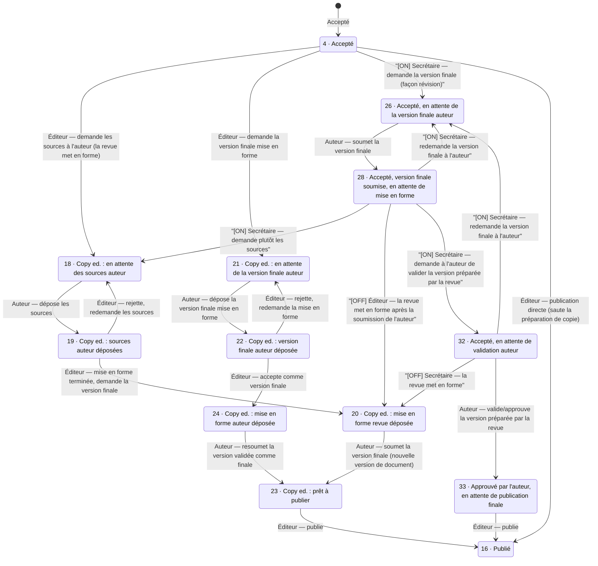

# Workflow éditorial post-acceptation (circuit actuel / classique)

*[English](post-acceptance-workflow.en.md) · [Français](post-acceptance-workflow.fr.md)*

Ce document cartographie le graphe de transition de statuts **existant** (non opt-in) qui s'exécute après l'acceptation d'un article (statut 4), à travers la préparation de copie, jusqu'à la publication (statut 16). Il sert de comparaison à la PR #1083 (« pipeline éditorial alternatif »), qui introduit un second workflow opt-in parallèle (statuts 34–39) couvrant conceptuellement le même terrain pour les revues basées sur arXiv. Voir `docs/paper-statuses.md` pour l'énumération complète des statuts.

Pour la phase soumission → relecture par les pairs → décision éditoriale qui précède celle-ci (statuts 0–17, y compris la boucle de révision et le fork des versions temporaires acceptées), voir **`docs/editorial-workflow.fr.md`** — ce document reprend exactement là où l'autre s'arrête, au statut 4/25.

Pour les codes/libellés de statut non détaillés ici, voir `docs/paper-statuses.md`.

## Relation avec le réglage « Allow post-acceptance revisions of articles »

Le réglage de revue intitulé **« Allow post-acceptance revisions of articles »** (FR : *« Permettre la demande de revision »*, `application/languages/en/views.php:2331`) correspond à `Episciences_Review::SETTING_SYSTEM_PAPER_FINAL_DECISION_ALLOW_REVISION` (`Review.php:140`), exposé dans la vue sous la variable `$isAskAuthorsFinalVersionEnabled` (`paper_status_button.phtml:3`).

**Ce réglage ne conditionne PAS l'intégralité du schéma ci-dessous** — seulement une partie :

* La boucle de préparation de copie (4→18→19→20→23→16 et 4→21→22→24→23→16, plus les boucles de rejet 19↔18 / 22↔21) est **toujours disponible**, quel que soit ce réglage.
* La branche 26/28/32/33 (le sous-flux « demander la version finale à l'auteur, façon révision ») n'existe **que lorsque ce réglage est activé**. Quand il est désactivé, les statuts 26/28/32/33 sont pratiquement inatteignables via l'interface — l'éditeur ne dispose que des points d'entrée 18/21 de la préparation de copie depuis le statut 4, et la seule action disponible au statut 28 se réduit à la même transition `reviewformattingdeposed` que le statut 19 (→ 20).
* Les arêtes marquées **[ON]** dans le schéma ci-dessous n'apparaissent dans l'interface que lorsque le réglage est activé ; celles marquées **[OFF]** n'apparaissent que lorsqu'il est désactivé. Les arêtes non annotées sont inconditionnelles.
* Ces boutons conditionnés par le réglage (sous-flux 26/28/32) ne sont exposés qu'au rôle **Secrétaire** dans `paper_status_button.phtml` — les vues Éditeur et Copy-editor n'ont pas de cas dédié pour le statut 32, et ne voient que les boutons inconditionnels 18/21 au statut 4 (pas l'option 26). L'ACL (`acl.ini`) accorde bien les actions de contrôleur sous-jacentes à l'éditeur/copy-editor aussi, mais l'interface ne les fait jamais apparaître à ce statut pour ces rôles.

## Schéma

`[ON]` = disponible uniquement quand *« Allow post-acceptance revisions of articles »* est activé pour la revue. `[OFF]` = disponible uniquement quand il est désactivé. Les arêtes non annotées sont inconditionnelles. Voir la section réglage ci-dessus.

*Note : le statut 27 (`STATUS_ACCEPTED_WAITING_FOR_MAJOR_REVISION`) se branche lui aussi depuis le statut 4, mais ramène vers la mécanique de tour de relecture (demande de modifications majeures), pas vers la préparation de copie — il est volontairement omis de ce schéma, hors périmètre.*

## Tableau des transitions

Colonne « Condition » : les arêtes inconditionnelles sont toujours disponibles quel que soit le réglage « Allow post-acceptance revisions of articles » ; les arêtes `[ON]`/`[OFF]` n'apparaissent dans l'interface que lorsque ce réglage est respectivement activé/désactivé. « Acteur » reflète le(s) rôle(s) qui obtiennent réellement un bouton pour cette transition dans `paper_status_button.phtml` — `acl.ini` peut accorder l'action de contrôleur sous-jacente plus largement (par ex. aussi à l'éditeur/copy-editor), mais l'interface ne la leur expose pas à ce statut.

| De → Vers | Condition | Acteur (interface) | Action / méthode | Libellé |
|---|---|---|---|---|
| 4 → 18 | — | Secrétaire/Éditeur/Copy-editor | `AdministratepaperController::waitingforauthorsourcesAction()` → `applyAction()` (`waitingforauthorsources`) | Demander les sources à l'auteur (la revue mettra en forme) |
| 4 → 21 | — | Secrétaire/Éditeur/Copy-editor | `AdministratepaperController::waitingforauthorformattingAction()` → `applyAction()` (`waitingforauthorformatting`) | Demander la version finale mise en forme |
| 4 → 26 | **[ON]** | Secrétaire uniquement (`paper_status_button.phtml:99-104`) | `acceptedaskauhorfinalversionAction()` → `revisionAction()` | Accepté, en attente de la version finale de l'auteur |
| 4 → 16 | — | Secrétaire toujours ; Éditeur si `editorsCanPublishPapers` | `publishAction()` | Publication directe, sans passer par la préparation de copie |
| 18 → 19 | — | Auteur | `PaperController::saveAuthorFormattingAnswer()` (`TYPE_AUTHOR_SOURCES_DEPOSED_ANSWER`) | L'auteur dépose les sources |
| 19 → 18 | — | Secrétaire/Éditeur/Copy-editor | action `waitingforauthorsources` réutilisée | Rejeter / redemander les sources |
| 19 → 20 | — | Secrétaire/Éditeur/Copy-editor | `reviewformattingdeposedAction()` → `applyAction()` (`reviewformattingdeposed`) | Mise en forme de la revue terminée, demander la version finale |
| 21 → 22 | — | Auteur | `saveAuthorFormattingAnswer()` (`TYPE_AUTHOR_FORMATTING_ANSWER`) | L'auteur dépose la version finale mise en forme |
| 22 → 21 | — | Secrétaire/Éditeur/Copy-editor | action `waitingforauthorformatting` réutilisée | Rejeter / redemander la mise en forme |
| 22 → 24 | — | Secrétaire/Éditeur/Copy-editor | `copyeditingacceptfinalversionAction()` → `applyAction()` (`copyeditingacceptfinalversion`) | Accepter comme version finale |
| 20 → 23 | — | Auteur | `PaperController::savenewversionAction()` → `determineNewPaperStatus()` | L'auteur soumet la version finale comme nouvelle version de document |
| 24 → 23 | — | Auteur | `savenewversionAction()` (`TYPE_AUTHOR_FORMATTING_VALIDATED_REQUEST`) | L'auteur resoumet la version validée comme finale |
| 26 → 28 | (atteint via le chemin [ON]) | Auteur | `PaperController::saveanswerAction()` | L'auteur soumet la version finale |
| 28 → 18 | **[ON]** | Secrétaire uniquement (`:515-520`) | action `waitingforauthorsources` réutilisée | Demander plutôt les sources |
| 28 → 20 | **[OFF]** | Secrétaire uniquement (`:143-152`) | `reviewformattingdeposedAction()` réutilisée | La revue met en forme après la soumission de la version finale par l'auteur |
| 28 → 26 | **[ON]** | Secrétaire uniquement (`:138-141`) | `acceptedaskauhorfinalversionAction()` réutilisée | Redemander la version finale à l'auteur |
| 28 → 32 | **[ON]** | Secrétaire uniquement (`:122-128`) | `acceptedaskauthorvalidationAction()` → `applyAction()` (`acceptedaskauthorvalidation`) | Demander à l'auteur de valider la version préparée par la revue |
| 32 → 20 | **[OFF]** | Secrétaire uniquement (`:212-220`) | `reviewformattingdeposedAction()` réutilisée | La revue met en forme |
| 32 → 26 | **[ON]** | Secrétaire uniquement (`:205-210`) | `acceptedaskauhorfinalversionAction()` réutilisée | Redemander la version finale à l'auteur |
| 32 → 33 | (atteint via le chemin [ON]) | Auteur | `savenewversionAction()` (`TYPE_ACCEPTED_ASK_AUTHOR_VALIDATION`) | L'auteur valide/approuve la version préparée par la revue |
| 23 → 16 | — | Secrétaire toujours ; Éditeur si `editorsCanPublishPapers` (`isReadyToPublish()`) | `publishAction()` | Publier |
| 33 → 16 | — | Secrétaire toujours ; Éditeur si `editorsCanPublishPapers` ; Copy-editor (cas dédié, `:541-552`) | `publishAction()` | Publier |

## Notes

1. **Le statut 4 est un point de branchement**, pas un chemin unique : un éditeur peut envoyer l'article dans le sous-flux de préparation de copie (18 ou 21), dans le sous-flux antérieur de « demande de version finale » (26/27/28, atteignable uniquement quand *« Allow post-acceptance revisions of articles »* est activé, piloté par la mécanique ordinaire de demande de révision), ou publier directement (4 → 16) si la revue autorise les éditeurs à sauter la préparation de copie.
2. **Deux mécanismes de réponse auteur distincts** coexistent : une réponse légère par commentaire (`saveAuthorFormattingAnswer()`) pour les statuts 18/21, et un formulaire complet « soumettre une nouvelle version de document » (`savenewversionAction()`) pour les statuts 20/24/32 — conditionné par `Episciences_CommentsManager::$_copyEditingFinalVersionRequest`.
3. **Le statut 23 (`CE_READY_TO_PUBLISH`) n'est jamais positionné que depuis `determineNewPaperStatus()`**, jamais directement par une action du staff — la balle est entièrement dans le camp de l'auteur une fois que la revue a mis en forme une version.
4. **Des arêtes de rejet existent déjà** dans le circuit classique (19→18, 22→21), de la même forme que les arêtes de rejet du pipeline alternatif (35→34, 37→36) ajoutées par la PR #1083.
5. **`publishAction()` est une action unique et inconditionnelle** qui positionne le statut 16 depuis n'importe quel statut ; les boutons de l'interface la conditionnent via `canPublish` / `isReadyToPublish()` (= {23, 33}).
6. **Le sous-flux 26/28/32/33 n'existe que lorsque « Allow post-acceptance revisions of articles » est activé.** Désactivé, un article accepté au statut 4 ne peut passer que par les points d'entrée 18/21 de la préparation de copie — le réglage revient à choisir entre « l'auteur resoumet formellement une version révisée via le pipeline de préparation de copie » (ON) et « préparation de copie seule, sans étape de validation formelle par l'auteur » (OFF/boucle CE par défaut via 23).
7. **Les boutons conditionnés par le réglage sont réservés au Secrétaire dans l'interface** (`paper_status_button.phtml` n'a aucun cas explicite pour les statuts 26/32 dans les blocs Éditeur ou Copy-editor) — même si `acl.ini` accorde les actions `administratepaper-*` sous-jacentes à l'éditeur/copy-editor/secrétaire indifféremment.
