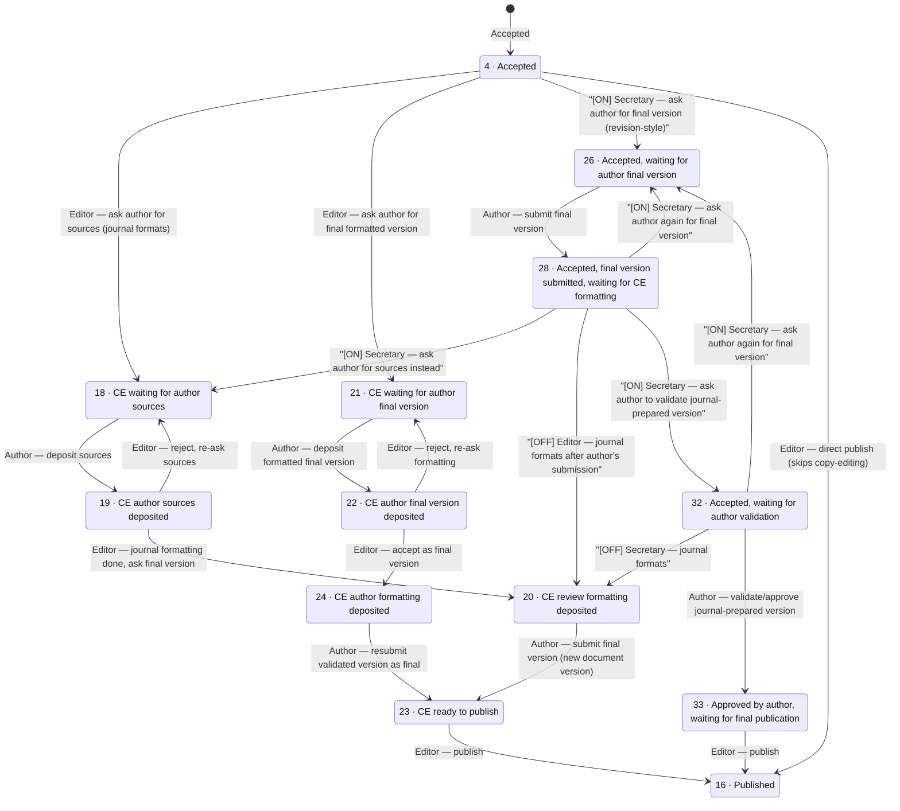

# Post-acceptance editorial workflow (current / classic pipeline)

This document maps the **existing** (non-opt-in) status transition graph that runs after a paper is accepted (status 4), through copy-editing, to publication (status 16). It exists as a comparison companion to PR #1083 ("alternative editorial pipeline"), which introduces a second, parallel opt-in workflow (statuses 34–39) covering conceptually the same ground for arXiv-based journals. See `docs/paper-statuses.md` for the full status enumeration.

For status codes/labels not detailed here, see `docs/paper-statuses.md`.

## Relation to the "Allow post-acceptance revisions of articles" setting

The journal setting labelled **"Allow post-acceptance revisions of articles"** (FR: *"Permettre la demande de revision"*, `application/languages/en/views.php:2331`) maps to `Episciences_Review::SETTING_SYSTEM_PAPER_FINAL_DECISION_ALLOW_REVISION` (`Review.php:140`), exposed in the view as `$isAskAuthorsFinalVersionEnabled` (`paper_status_button.phtml:3`).

**This setting does NOT gate the whole diagram below** — only part of it:

* The copy-editing loop (4→18→19→20→23→16 and 4→21→22→24→23→16, plus the 19↔18 / 22↔21 reject loops) is **always available**, regardless of this setting.
* The 26/28/32/33 branch (the "ask author for final version, revision-style" sub-flow) only exists **when this setting is ON**. When it is OFF, statuses 26/28/32/33 are effectively unreachable through the UI — the editor only has the 18/21 copy-editing entry points from status 4, and status 28's only available action collapses to the same `reviewformattingdeposed` transition as status 19 (→ 20).
* Edges marked **[ON]** in the diagram below only appear in the UI when the setting is enabled; edges marked **[OFF]** only appear when it's disabled. Unmarked edges are unconditional.
* These setting-gated buttons (26/28/32 sub-flow) are only exposed to the **Secretary** role in `paper_status_button.phtml` — Editor and Copy-editor views don't have a dedicated case for status 32, and only see the unconditional 18/21 buttons at status 4 (not the 26 option). ACL (`acl.ini`) does grant editor/copyeditor the underlying controller actions too, but the UI never surfaces them at that status for those roles.

## Diagram

`[ON]` = only available when *"Allow post-acceptance revisions of articles"* is enabled for the journal. `[OFF]` = only available when it is disabled. Unmarked edges are unconditional. See the setting section above.

*Note: status 27 (`STATUS_ACCEPTED_WAITING_FOR_MAJOR_REVISION`) branches off status 4 as well, but leads back into the review-round machinery (major revision request), not into copy-editing — it is intentionally omitted from this diagram as out of scope.*

## Transition table

"Gate" column: unconditional edges are always available regardless of the "Allow post-acceptance revisions of articles" setting; `[ON]`/`[OFF]` edges only appear in the UI when that setting is respectively enabled/disabled. "Actor" reflects which role(s) actually get a button for this transition in `paper_status_button.phtml` — `acl.ini` may grant the underlying controller action more broadly (e.g. to editor/copyeditor too), but the UI doesn't expose it to them at that status.

| From → To | Gate | Actor (UI) | Action / method | Label |
|---|---|---|---|---|
| 4 → 18 | — | Secretary/Editor/CopyEditor | `AdministratepaperController::waitingforauthorsourcesAction()` → `applyAction()` (`waitingforauthorsources`) | Ask author for sources (journal will format) |
| 4 → 21 | — | Secretary/Editor/CopyEditor | `AdministratepaperController::waitingforauthorformattingAction()` → `applyAction()` (`waitingforauthorformatting`) | Ask author for final formatted version |
| 4 → 26 | **[ON]** | Secretary only (`paper_status_button.phtml:99-104`) | `acceptedaskauhorfinalversionAction()` → `revisionAction()` | Accepted, waiting for author's final version |
| 4 → 16 | — | Secretary always; Editor if `editorsCanPublishPapers` | `publishAction()` | Direct publish, bypassing copy-editing entirely |
| 18 → 19 | — | Author | `PaperController::saveAuthorFormattingAnswer()` (`TYPE_AUTHOR_SOURCES_DEPOSED_ANSWER`) | Author deposits sources |
| 19 → 18 | — | Secretary/Editor/CopyEditor | `waitingforauthorsources` action reused | Reject / re-ask sources |
| 19 → 20 | — | Secretary/Editor/CopyEditor | `reviewformattingdeposedAction()` → `applyAction()` (`reviewformattingdeposed`) | Journal formatting done, ask for final version |
| 21 → 22 | — | Author | `saveAuthorFormattingAnswer()` (`TYPE_AUTHOR_FORMATTING_ANSWER`) | Author deposits formatted final version |
| 22 → 21 | — | Secretary/Editor/CopyEditor | `waitingforauthorformatting` action reused | Reject / re-ask formatting |
| 22 → 24 | — | Secretary/Editor/CopyEditor | `copyeditingacceptfinalversionAction()` → `applyAction()` (`copyeditingacceptfinalversion`) | Accept as final version |
| 20 → 23 | — | Author | `PaperController::savenewversionAction()` → `determineNewPaperStatus()` | Author submits final version as new document version |
| 24 → 23 | — | Author | `savenewversionAction()` (`TYPE_AUTHOR_FORMATTING_VALIDATED_REQUEST`) | Author resubmits validated version as final |
| 26 → 28 | (reached via [ON] path) | Author | `PaperController::saveanswerAction()` | Author submits final version |
| 28 → 18 | **[ON]** | Secretary only (`:515-520`) | `waitingforauthorsources` action reused | Ask for sources instead of a final version |
| 28 → 20 | **[OFF]** | Secretary only (`:143-152`) | `reviewformattingdeposedAction()` reused | Journal formats after author's final-version submission |
| 28 → 26 | **[ON]** | Secretary only (`:138-141`) | `acceptedaskauhorfinalversionAction()` reused | Ask author again for final version |
| 28 → 32 | **[ON]** | Secretary only (`:122-128`) | `acceptedaskauthorvalidationAction()` → `applyAction()` (`acceptedaskauthorvalidation`) | Ask author to validate journal-prepared version |
| 32 → 20 | **[OFF]** | Secretary only (`:212-220`) | `reviewformattingdeposedAction()` reused | Journal formats |
| 32 → 26 | **[ON]** | Secretary only (`:205-210`) | `acceptedaskauhorfinalversionAction()` reused | Ask author again for final version |
| 32 → 33 | (reached via [ON] path) | Author | `savenewversionAction()` (`TYPE_ACCEPTED_ASK_AUTHOR_VALIDATION`) | Author validates/approves journal-prepared version |
| 23 → 16 | — | Secretary always; Editor if `editorsCanPublishPapers` (`isReadyToPublish()`) | `publishAction()` | Publish |
| 33 → 16 | — | Secretary always; Editor if `editorsCanPublishPapers`; CopyEditor (dedicated case, `:541-552`) | `publishAction()` | Publish |

## Notes

1. **Status 4 is a branch point**, not a single path: an editor can send the paper into the copy-editing sub-flow (18 or 21), into the earlier "final version request" sub-flow (26/27/28, only reachable when *"Allow post-acceptance revisions of articles"* is ON, driven by ordinary revision-request machinery), or publish directly (4 → 16) if the journal allows editors to skip copy-editing.
2. **Two distinct author-reply mechanisms** exist in parallel: a lightweight comment-reply (`saveAuthorFormattingAnswer()`) for statuses 18/21, and a full "submit new document version" form (`savenewversionAction()`) for statuses 20/24/32 — gated by `Episciences_CommentsManager::$_copyEditingFinalVersionRequest`.
3. **Status 23 (`CE_READY_TO_PUBLISH`) is only ever set from `determineNewPaperStatus()`**, never directly by a staff action — the ball is entirely in the author's court once the journal has formatted a version.
4. **Backward/reject edges already exist** in the classic flow (19→18, 22→21), the same shape as the alternative pipeline's reject edges (35→34, 37→36) added by PR #1083.
5. **`publishAction()` is a single, unconditional action** that sets status 16 from any status; UI buttons gate it behind `canPublish` / `isReadyToPublish()` (= {23, 33}).
6. **The 26/28/32/33 sub-flow only exists when "Allow post-acceptance revisions of articles" is ON.** With it OFF, a paper accepted at status 4 can only go through the 18/21 copy-editing entry points — the setting effectively chooses between "author formally re-submits a revised version through the copy-editing pipeline" (ON) vs. "copy-editing only, no formal author validation step" (OFF/default CE loop through 23).
7. **Setting-gated buttons are Secretary-only in the UI** (`paper_status_button.phtml` has no explicit case for statuses 26/32 in the Editor or CopyEditor blocks) — even though `acl.ini` grants the underlying `administratepaper-*` actions to editor/copyeditor/secretary alike.
